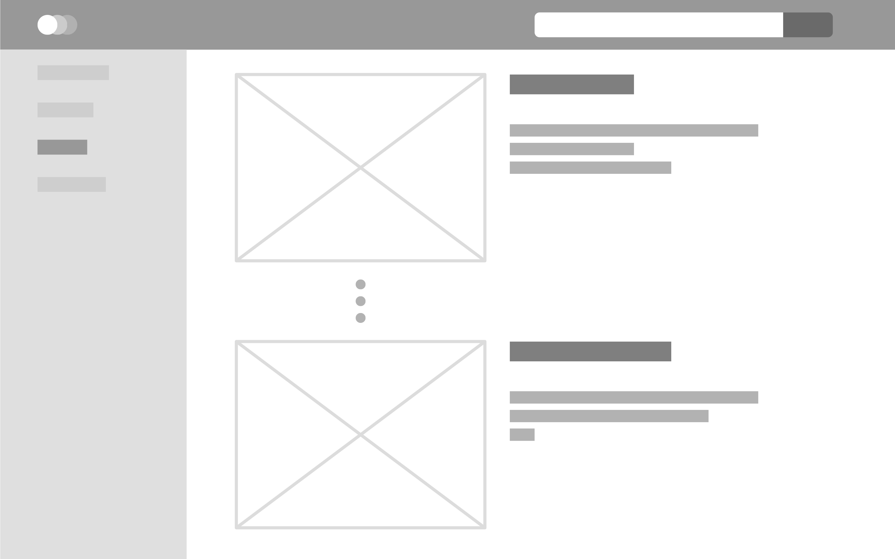

# Front-end development exercise - Image Viewer

### Task
Build a browser based web application that fetches and displays images from a publicly available API - either the [Metropolitan Museum of Art](https://metmuseum.github.io/) or [Nasa's account via the Flickr API](API_DETAILS.md).  Use the technology (React, Angular, Vue.js, etc.) and components from the [Carbon Design System](https://www.carbondesignsystem.com/developing/frameworks/react/) that you're comfortable with, however, the technology mentioned in the job position would be preferred.  Include some basic test automation and expect to spend up to eight hours on this exercise over the course of several days.

**This example design is in no way prescriptive on how the app must look.**

### Criteria
 - Implementation of basic functionality - displaying images with data coming from an API
 - Implementation of features that you see fit for an image viewing application
 - Choice of design, layout, and intuitiveness of the interface
 - Page load times and performance
 - Use of test automation
 - Use of source control to organize and store code
 - Be prepared to discuss approach, decisions, challenges, and future enhancements

### Submission Requirements
Preferably send us a link to your repository with your implementation, otherwise, email your code to us.  In either case, we must be able to view your source code and be able to run it. 

### Questions?
If there's anything that's unclear or if you just have a general question, we're just an email away! :)
